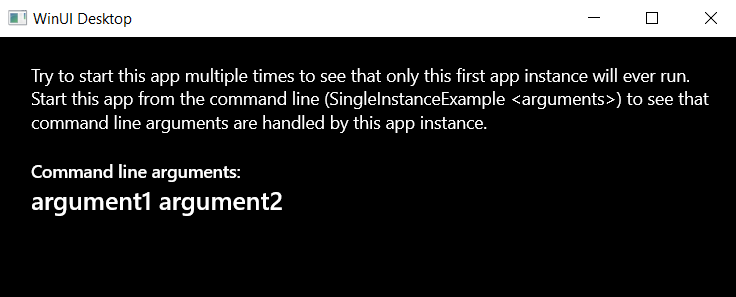

# WinUI Desktop Single Instance Example

Example on how to create a single instance WinUI Desktop app.

Try to start this app multiple times (e.g. from the start menu) to see that only one app instance keeps running.

This app can also be used as a CLI and processes command line arguments. To make this work, an execution alias is added to the manifest (see the manifest of the package project for details).

For example type this on the command prompt:

```
> SingleInstanceExample argument1 argument2
```

And see the arguments displayed in the main window:

